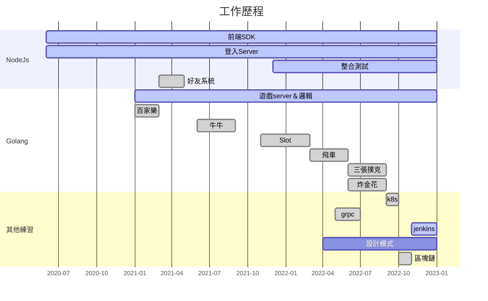

我的名字叫陳有信，27歲。住在新北市中和區一帶，未婚。我在天堂遊戲服務。每天都沒加班晚上7點就回家。我不抽煙，酒也未嚐。晚上12點睡，每天要睡足6個小時。睡前，我一定玩幾場遊戲，然後做0分鐘的柔軟操，上了床，馬上熟睡。一覺到天亮，疲勞和壓力也會留到第二天。醫生都說我很不正常。

## 

## NodeJS
1. 前端SDK: 與後端溝通的檔案
1. 登入Server: 前端透過WS來進行連線互動
1. 整合測試: 伴隨遊戲&功能開發,確保品質而模擬前端進行測試
1. 好友系統: 應用reids & db 的功能 

## Golang
1. 遊戲Server&邏輯: 遊戲核心
    1. 百家樂,飛車: 多人場遊戲,房間內所有玩家共同取得相同結果
    2. 牛牛,三張撲克,炸金花: 房間遊戲,每次新局都有不一樣結果
    3. Slot: 單人遊戲

## 其他練習
1. k8s: yaml寫的好,輕鬆沒煩惱(XD)
1. grpc: 用來練習以後製作遊戲使用
1. jenkins: 學習CI/CD 多熟悉shell語法
1. 設計模式: 還債,把程式寫的美美噠(工作不常使用XD)
1. 區塊鏈: 了解原理,並構想未來在遊戲應用
    * 對博弈來說是個潛力,可用開分機制

## 其他工作上使用工具
1. db： 已noSQL為主,SQL接觸較少
1. MQ： Nats,其他接觸較少
1. Redis: 用來暫存資料
    1. 服務重起
    1. 暫時性,不重要資料
    1. 多服務共用記憶體

## 遊戲製作心得 || 筆記
1. 百家樂: 開始寫go的處女作
    1. 每次下注都要"寫入"下注資料到db,用"更新"的方式時間會太久,
    1. 每次下注都會通知玩家下注後金額,最後派彩則是一次通知即可

1. 牛牛,三張撲克,三張撲克
    1. 牌局開始就可以計算結果了
    1. 狀態時間結束時,要幫玩家||電腦自動執行動作
    1. 計算電腦動作方式

1. Slot: 最簡單
    1. 一次下注一筆下注資料