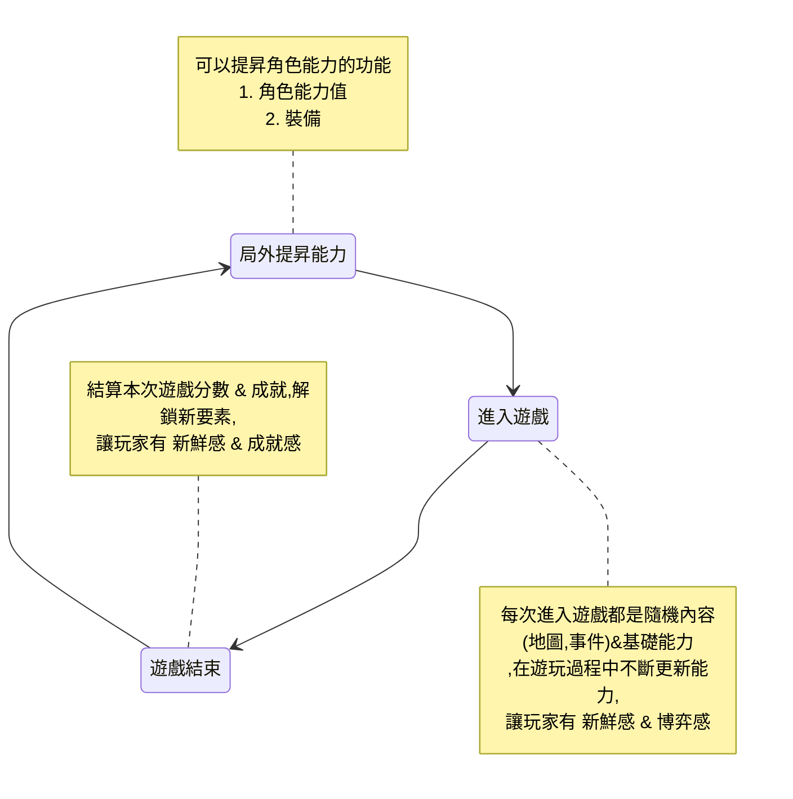

## RogueLike

#### [原文網址](https://medium.com/that-game-designer/%E9%81%8A%E6%88%B2%E9%A1%9E%E5%88%A5%E5%B0%88%E9%A1%8C-rogue-like-part-01-7819144ce9e0)

讓玩家失敗的時候,歸咎於"運氣不好"而不是"技巧不足"

### 要素
1. 隨機生成的遊戲環境
1. 死亡後必須重頭再來（永久死亡制）
1. 單一模式：即戰鬥，移動和其他行動都在同一個模式進行。不會有「進入戰鬥」等等的狀態切換。
1. 怪物與玩家角色適用同樣規則
1. 內容的多樣性
1. 分配有限資源
1. 探索
1. 戰術挑戰
1. 地牢

## 遊戲迴圈

## 核心價值
1. 玩家在每局遊戲成長都有不一樣的體驗(Gold Experience)
1. 水平擴展,而不要垂直成長
    * 垂直成長,原本內容上"單純數值變強"(ex. 裝備+1+2..+9),最後演變成數值比拼,失去了rogue的韻味
    * 水平擴展,原架構上新增內容(ex.新的職業,裝備效果)
1. 測試困難,每件裝備的搭配組合近乎無限領域展開 無量空處,但請加油還是要測試,畢竟平衡還是要保持
1. 上面說保持平衡是放屁,確保玩家每次遊戲拿到的能力都不一樣的話,會讓玩家有更好的體驗,因為玩家可能玩了N局才當到了"天選之子"而感到興奮
1. 付費點
    1. 局外成長,是要帶到局內去體驗的，因此要確保局內的數值能夠應付不斷成長的局外累積
    1. 成就感: 意識到技巧或策略上的進步，同時願意為了額外的成就感(或能夠獲得成就感的機會)而付費
    1. 新的刺激: 新要素，新職業等等，讓遊戲更加豐富的內容。某程度上和DLC的賣點類似
    1. 便利/縮短資源取得時間的功能: 包括額外獲取資源，擴展背包倉庫等等
    1. 惋惜感: 接關，保留道具等等
    1. 額外加成: 金幣加倍，或是結算時開寶箱可以多開...等
1. 降低挫折感
    1. 累積獎勵: 即使失敗也可以慢慢增強角色
    1. 回顧該局內容: 讓玩家看看他們迫害了多少敵人,獲得多少道具
    1. 成就圖鑑系統: 純粹「讓玩家看爽」的,解鎖道具
    1. 墓碑系統: 就是玩家死亡後，會在該點留下一些資源，讓玩家下次再到同一個地點(或是生成時隨機擺放)時，可以回收一些資源
1. 不要讓敵人與玩家有針對性機制與裝備,會導致玩家遇到此敵人時放棄or跳過,未來遇到相同敵人時,也會直接放棄
1. 風險與回報
    1. 隨機房間內擺著挑戰寶箱，玩家想要開啟寶箱，就需要面對額外的精英等級怪物圍攻，但玩家也可以選擇不開啟寶箱，避開風險
    1. 讓玩家使用自己當前的生命值來兌換隨機道具...等

### 補充
https://www.youtube.com/watch?v=terD4Bk3L_8&t=7s